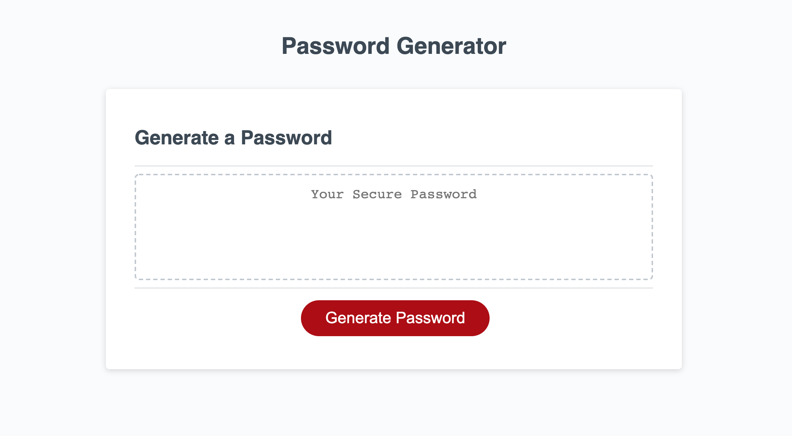

# Could this password BE any more random?!?!?

[Live Demo](https://sissyhanks.github.io/could-this-password-be-any-more-random/)

## Description

This password generator will return a password of a length indicated by the user randomly selected from user chosen character sets.

I learned to expect to have to tell my program to do many more things than I expected (like remove commas and spaces from arrays when writing them to the screen as a password) along with the fact the I can use javascript as a development tool (like writing a piece of code that will return a string of characters as an array to use in my code!)

This project was my first pass at joining my problem solving approach within the framework provided by javascript.After this build i feel like i am getting a sense of how different components of javascript work, but I need to develop a deeper understanding of how to lay them out and join them together. I trust that as I learn more about the language my solutions will become more elegant.

## Usage

If you need an actual secure password, probably don't.

## Features

One thing this password generator will do is return at least on character of each criteria type selected by the used.

## Tests

The code is written to log critical information to the console to ensure proper function and call out at what point in the code a bug might be hiding.
